# GitHub 기본적인 사용법 정리

## Git? GitHub?

### Git?

- 버전관리 시스템의 한 종류로 프로젝트의 버전/이력 관리와 개발시 협업을 위한 도구로 사용됨.

- 로컬에 저장된 기록들을 외부 서버에 올려 환경이 바뀌더라도 원하는 시점의 프로젝트를 내려받을 수 있게 하거나, 다른사람이 작업한 변경 내역을 합치는 등 협업을 위한 다양한 기능을 제공함

### GitHub?

- Git의 원격 저장소 및 프로젝트 전반의 관리 기능을 제공하고 이를 다른 사람들과 공유할 수 있는 웹 기반 솔루션 중 하나.

### Why Git/GitHub?

#### 1. 실제 우리가 사용할 때 소스코드의 백업 및 버전관리를 위해서 꼭 필요함

- 아이디어를 적용햇을 때, 필요에 따라 이전 버전의 코드로부터 다시 수정을 시작할 때
- 컴퓨터 날라갈때

#### 2. 하나의 프로젝트에 대해서 여러 컴퓨터에서 실험을 진행할 때 매우 편리함

- 원하는 PC에서 바로 버전관리된 소스코드를 다운받아서 학습 및 테스트를 진행할 수 있으므로 간편

#### 3. 하나의 프로젝트를 여러명이 공유하는 경우 꼬이지 않고 간편하게 소스코드를 공유 및 협업할 수 있어 편리함

- 전체 프로젝트 관리자의 허락 하에 수정된 코드를 업데이트 할 수 있으므로, 소스코드를 공유할 때 꼬이지 않고 편하게 프로젝트 진행이 가능함

### How to Use Git?

	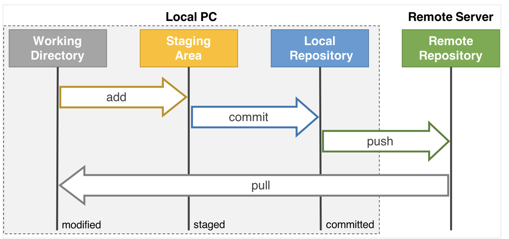

    <em>[ Git을 이용한 작업의 단계별 모식도 ]</em>

**[ Local 환경 ]**

- Working Directory: 현재 작업중인 Git 프로젝트 파일들이 있는 내 PC의 디렉토리. 자유롭게 작업
- Staging Area: Commit을 하기 위해 대기중인 파일들로 `git add` 명령어를 사용해 이 스테이지로 넘길 수 있다.
- Local Repository: Commit을 한 파일들이 스냅샷으로 기록된 곳 `git commit` 명령어르를 사용해서 Staging Area로부터 Local Repository로 올릴 수 있음.

**[ Remote 환경 ]**

- Remote Repository: 원격 서버, 즉 GitHub에서 관리되는 원격 저장소로, 이곳에 파일을 올리면 외부 저장소에 저장이 되는 것으로, Commit 단위로 해당 버전의 프로젝트를 추후 내려받을 수 있음. Local의 파일들이 손상되더라도 원격 저장소의 파일들은 손상되지 않음 

## Git 설치

### OS X의 경우

-  `brew install git`을 통해서 쉽게 설치할 수 있다.
-  `brew upgrade git`을 통해서 업데이트
-  `git --version`을 통해서 버전확인

### Ubuntu의 경우: 

- `sudo apt-get install git`을 통해서 패키지 리스트를 업데이트
- `sudo apt install git` 명령어를 이용하여 깃을 설치
-  `git --version`을 통해서 버전확인

## Git의 활성화

처음 Git을 관리해주려는 최상위 폴더에서 **Git을 활성화** 해주어야 한다. 

	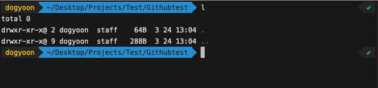

    <em>[ Git을 활성화 해주기 전 폴더 ]</em>

> 활성화 해주지 않았을 때는 위와 같이 `.git`파일이 보이지 않는다

`git init` 명령어를 통해 Git을 활성화 해주면 

	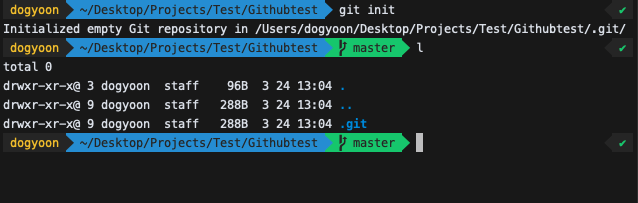

    <em>[ Git을 활성화 한 후의 폴더 ]</em>

> 활성화 한 뒤에는 Git 최상위 홀더에서 `.git`파일이 보인다

## Local Repository 생성 및 관리

Local 프로젝트를 하나 생성해보자.

`local_project` 라는 폴더에 `local.py` 파일을 생성하였다.
`git status` 명령어를 통해 현재 파일들이 모두 working directory에 잇음을 알 수 있다.

	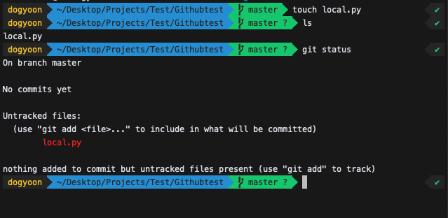

    <em>[ 파일 생성 및 git status 확인 ]</em>

> master branch에 있으며, commit이 아직 없음을 알 수 있다

add 을 통해 Staging Area에 올려보자.
`git add <디렉토리 혹은 파일명>` 명령어를 통해 올릴 수 있다.
`git add .` 을 통해 현재 디렉토리에서 하위 디렉토리를 포함한 모든 파일을 한번에 올릴 수 있다.

	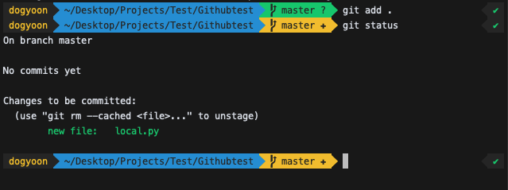

    <em>[ git add 및 git status 확인 ]</em>

이제 `commit -m '업데이트 내용'` 명령어를 통해 커밋을 진행할 수 있다.

	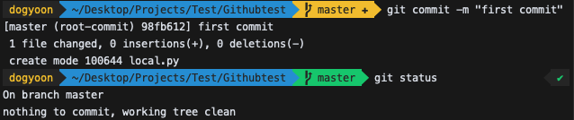

    <em>[ git commit 및 git status 확인 ]</em>

커밋 이후에 `git log`명령어를 통해 커밋이 정상적으로 저장되었다는 것을 확인할 수 있다.

	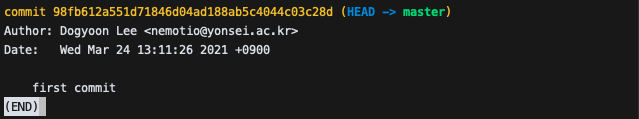

    <em>[ git log 의 내용 ]</em>

위에 보이는 커밋의 해시코드는 이후 해당 버전으로 돌아오고 싶을 때, 혹은 해당 커밋의 파일을 불러오고 싶을 때 등의 상황에서 색인으로 사용됨.

이제 Local Repository의 내용을 Remote Repository에 올려 언제 어디서든 접근 및 작업이 가능하게 해보자.

## Remote Repository 생성 및 관리

GitHub를 통해 프로젝트를 공유 및 백업하기 위해서는 GItHub에 **Repository**를 생성해야 한다.

Push를 통해 Remote Repository에 업로드한 프로젝트 현황을 보려면 이를 담고 있는 저장소에 접근할 수 있어야 하고 Github는 이를 위한 저장소 및 url을 제공한다.

	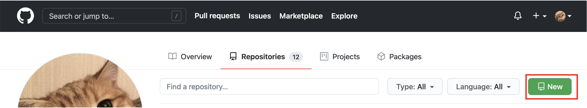

    <em>[ Repository 생성 버튼 클릭해서 repository 생성]</em>

아까 만들었던 로컬 저장소와 원격 저장소는 각각 생성은 되어있으나 연결되어있지 않으므로, **두 저장소를 연동**시켜주어야한다.

연동시켜 주기 위해서는 생성한 원격 저장소의 url을 알아야 하는데 아래 그림과 같이 확인할 수 있다.

	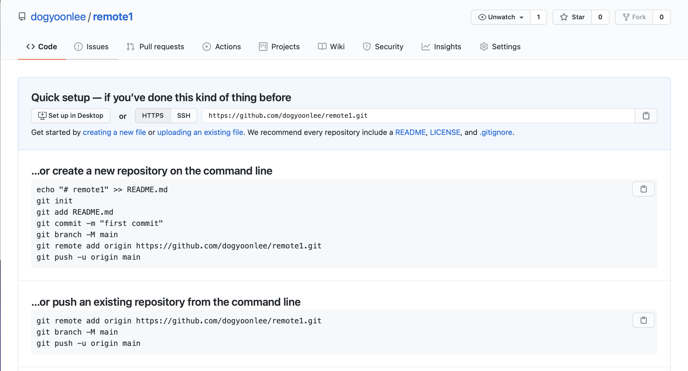

    <em>[ 원격 저장소 주소: README.md 없이 생성해야한다. ]</em>

> 이제 push를 할건데 Git의 버전이 올라가면서 기본으로 설정되어 있는 branch가 `master`에서 `main`으로 바뀌면서, branch 명이 달라서 push 하려는 경우 에러가 발생하게 된다.

> 해결하는 방법중의 하나는 `git branch -m master`를 이용해서 main로컬의 `master` branch의 이름을 `main`으로 변경한 후 push하는 것이다.

	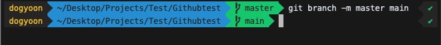

    <em>[ git branch 이름 바꾸기 ]</em>

> 애초에 Git 자체의 default branch의 이름을 `main`으로 변경하는 것도 좋은 방법이다.

	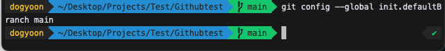

    <em>[ git branch 기본이름 바꾸기 ]</em>

> 위와 같이 `git config --global init.defaultBranch main`으로 진행하면 바꿀수 있다.

GitHub의 원격 저장소의 주소를 로컬과 연결시켜준 뒤에 `push` 해준다.

	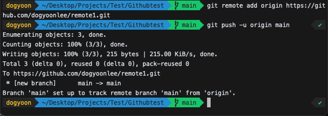

    <em>[ git push ]</em>

> GitHub의 원격 저장소를 생성할 때 `README.md` 파일을 생성하지 않아야 충돌이 없다.

GitHub의 원격 저장소를 가보면 업데이트가 된 것을 볼 수 있다.

	

    <em>[ 업데이트된 GitHub 저장소 ]</em>

#### 아이디, 패스워드 저장하기 

Push를 하는 경우 사실 깃허브의 매번 패스워드를 묻게 되는데 귀찮다.

아래와 같은 과정을 통해서 매번 안해도 된다.

- `git config global user.name "이름"`
- `git config --global user.email 이메일@주소`

위와 같이 등록한 후에

- `git config credential.helper store --global`: 매번 입력해야 하는 인증르 캐시에 저장하여 일정시간동안 입력하지 않는방법이다.
- git 명령어를 입력하면, 처음에 한번은 아이디와 패스워드창이 나타난다.
- 계정을 입력한 후에는 정보가 저장되어 입력하지 않아도 된다.
- 이후 아래 커맨드를 활용하여 캐시 저장 만료시간을 입력해준다.
- `git config --global credentail.helper 'cache --timeout 3600'`: timeout 뒤의 숫자는 초(second)로, 예를들면 3600은 1시간을 의미한다.

참고자료 및 그림 출처: [[Acka1357's Blog]](https://www.secmem.org/blog/2019/04/10/git_pr/)