# GitHub Branch 관리
## Branch?

- Git은 현재 작업하고 있는 내용이 이전에 작업하던 내용, 혹은 같이 작업하는 동료와 섞이지 않도록 독립적으로 작업을 진행하기 위한 개념. 
- 만들어지는 각각의 브랜치는 기본적으로 서로 다른 브랜치의 영향을 받지 않기 때문에 여러 작업을 동시에 진행할 수 있다.

### Branch 확인

- `git branch`: 현재 Branch를 확인 가능하다.
- `git branch -r`: 원격 저장소의 Branch 확인
-  `git branch -a`: 모든 Branch 확인
-  `q` 버튼을 통해 빠져나올 수 있음
-  `*`표시가 붙은 Branch가 현재 활성화 된 Branch이다.

	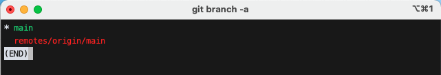

    <em>[ git branch -a ]</em>

- `git branch -v`: Branch의 마지막 Commit 메세지 확인

	

    <em>[ git branch -v ]</em>

### Local Branch 생성 및 이동
#### 1번 방법

- `git branch 브랜치명`: Branch 생성
- `git checkout 브랜치명`: 생성한 Branch 로 이동

	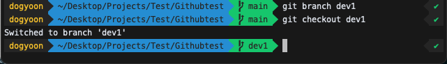

    <em>[ 1번방법 ]</em>

#### 2번 방법

- `git checkout -b 브랜치명`: `-b` 옵션을 사용하여 생성 후 바로이동

	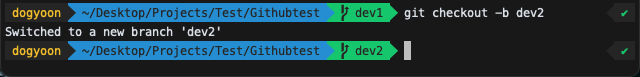

    <em>[ 2번방법 ]</em>

#### Local Branch 삭제하기

- `git branch -d 브랜치명`: 로컬의 Branch 삭제
- 단, 작업된 사항이나 commit한 이력이 남아있는 경우, 해당 comand로 branch가 삭제되지 않는 경우가 있다. 이떄는 `git branch -D 브랜치명`을 사용하여 강제로 삭제할 수 있다.

	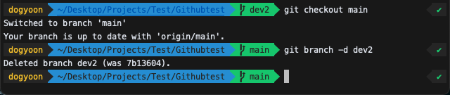

    <em>[ dev2 Branch 삭제 ]</em>

	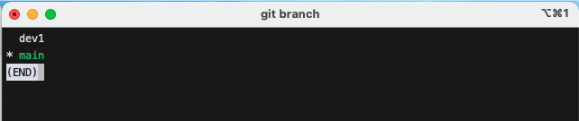

    <em>[ 삭제된 것 확인 ]</em>

#### 생성한 Local Branch를 원격 Repository에 push 하기

	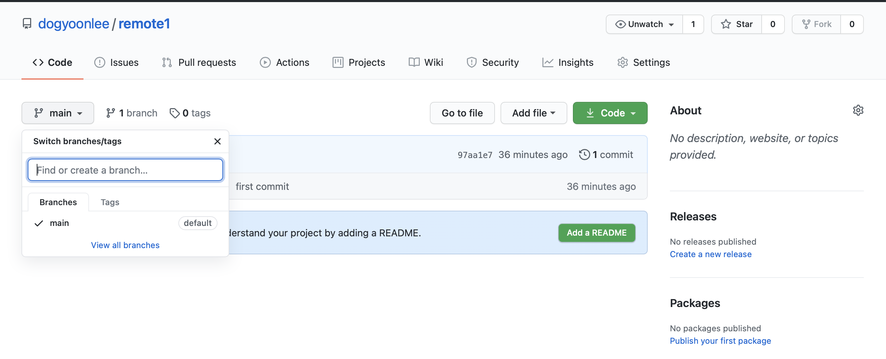

    <em>[ 원격저장소는 main Branch만 있다. ]</em>

- 원격 저장소에는 `main` branch 밖에 없는 상태이고, `dev1` branch 에서 push 하면 오류가 발생한다.
따라서 `--set-upstream` 옵션을 주어야 traking 정보가 설정이 되어 git push만 사용해도 push가 된다.

	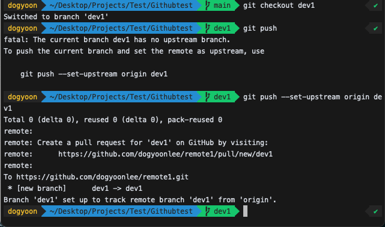

    <em>[ 원격에 push ]</em>

> `git push -u origin dev1`으로 줄여서 push 도 가능하다.

	

    <em>[ 원격저장소에 dev1 Branch도 생겼다. ]</em>

- GitHub 페이지로 가보면 Branch가 생성되어 2개의 branch로 늘어난 것을 볼 수 있다. 

#### Local Branch를 삭제한다고 해도 원격 저장소에서는 삭제되지 않는다.

	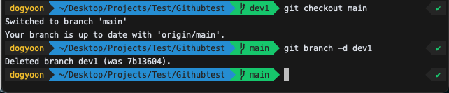

    <em>[ Local에서 dev1 삭제. ]</em>

	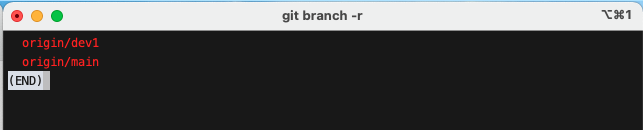

    <em>[ 원격저장소에 dev1 Branch는 그대로. ]</em>

	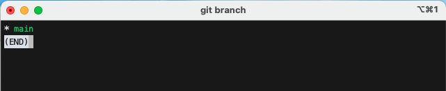

    <em>[ Local에 dev1 Branch는 삭제 ]</em>

#### Local에는 없는 Branch를 원격 저장소에서 가져오는 방법

- `git checkout -t remote_path/branch_name`

	

    <em>[ Local에는 없던 dev1 Branch를 가져옴 ]</em>

#### 원격 저장소의 branch를 삭제하는 방법
##### 1번방법: Local에는 남아있음

- `git push origin --delete 원격브랜치명`

	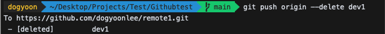

    <em>[ 원격저장소의 Branch만 삭제 ]</em>

##### 2번방법: Local에서도 삭제됨

- `git branch -d 로컬브랜치`
- `git push origin 원격브랜치`

## Branch 병합(Merge)

서로 다른 두 Branch를 이제 병합해보자.

- 새로 `dev2` 브랜치를 만들고, 새로운 파일인 `new.py`를 만들어보자

	

    <em>[ dev2 Branch 생성 및 파일 생성 ]</em>

- 신규 `new.py` 파일을 커밋

	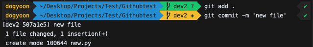

    <em>[ 신규 파일을 커밋 ]</em>

- `dev2` branch에 신규 파일이 생성되었고, 이를 `dev1`에도 똑같이 생성하고 싶다고 하자. 
-  branch를 이동하여 또다시 작성을 해도 좋짐한, **merge** 기능을 사용해서 `dev2` branch에서 합칠 수 있다.
-  `main` branch는 웬만하면 건드리지 않도록 하자

	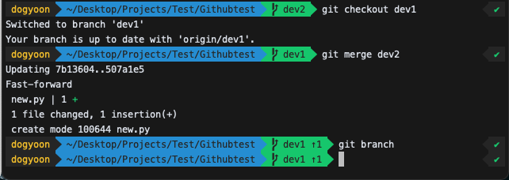

    <em>[ dev2 Branch의 내용을 dev1 branch에서 merge ]</em>

- **merge**한 branch인 `dev2`는 지워주고, `dev1`은 원격 저장소에 push

	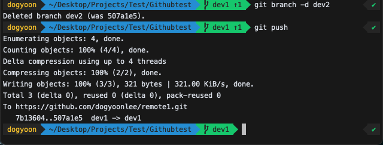

    <em>[ dev2 Branch를 지워주고, dev1은 원격 저장소에 push ]</em>

	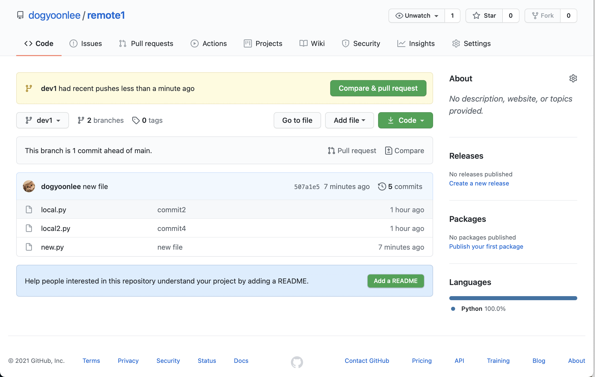

    <em>[ 수정사항이 반영된 dev1 branch Branch ]</em>

- 즉, 다른 브랜치에서 했던 작업 내용을 가져오고 싶을 때 **merge**를 사용할 수 있다.

## Git Conflict 상황 해결하기

간단한 소스 충돌 상황을 만들어보자.

- `function.py` 파일을 아래 내용과 같이 만들고 `dev2` branch를 만들자.

	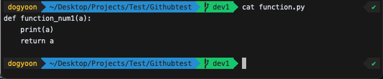

    <em>[ function.py 원본 ]</em>

- 각각 아래와 같이 함수이름을 수정하고 커밋해보자

	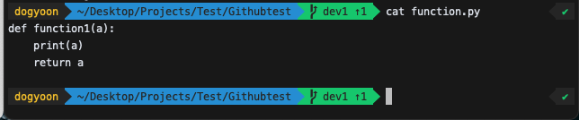

    <em>[ dev1 - function.py 수정 ]</em>

	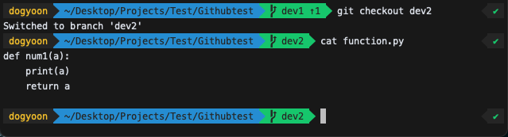

    <em>[ dev2 - function.py 수정 ]</em>

- branch를 **merge** 하면 에러가 발생한다.

	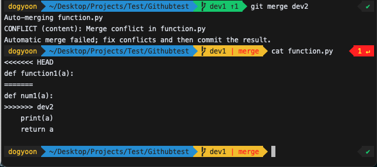

    <em>[ Merge 시 Conflit 발생 ]</em>

- 내용을 살펴보면, 
- 위: **HEAD**로 표시되어 있는 내용이 `dev1`에서 한 작업
- 아래: `dev2`로 표시되어 있는 내용이 `dev2`에서 한 작업

- 각각 Branch에서 동일한 파일을 수정하였는데, merge를 하려고 했을 떄 git이 어떤 내용이 맞는지 판단할 수가 없기 때문에 충돌이 발생하였다고 알려준다.

#### 해결방안

##### 직접수정

- 직접 양 브랜치간의 내용을 비교하여 수정 후 add, commit 처리한다.
- 문제가 있는 source  코드를 열어서 두 파일의 충돌 부분을 보고 바꿔준다.(vim 에디터를 사용했음)

	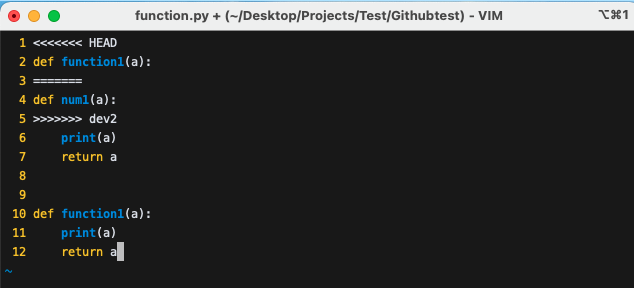

    <em>[ 문제가 있는 부분을 수정 ]</em>

- 수정 후에 다시 `commit` 처리하면 커밋 메세지가 나오는데 그대로 사용해보겠다(:wq를 입력하여 저장)

	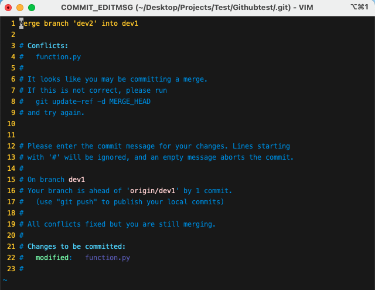

    <em>[ 다시 Commit 처리 ]</em>

- 커밋 처리가 되었음을 알 수 있다.

	

    <em>[ Commit 되었음 ]</em>

- `git log`를 활용하여 commit 내역을 보면 잘 commit 되었음을 알 수 있다.

	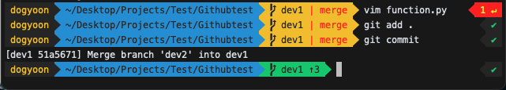

    <em>[ Commit 확인 ]</em>

##### Merge 작업 취소

- `git merge --abort`: Merge를 하다가 Conflict가 발생했을 때, 일단은  merge 작업을 취소하고 이전 상태로 돌아갈 수 있다.

	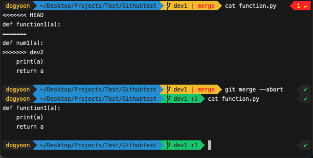

    <em>[ Merge 취소 ]</em>

- merge  전으로 돌아갔음을 알 수 있다.

### 추가적인 Branch 관련 명령어들

- `git fetch`: git 서버에서 최신 코드 받아오기
- `git pull`: git 서버에서 최신코드 받아와서 merge 하기
-  `git reset`

### 다음 페이지 바로가기

- [[메인페이지]](./README.md)
-  [[1. 깃허브 기초]](./GitHub_Basic.md.md)
-  [[3. 깃허브 커밋 되돌리기]](./GitHub_Commit_reset_revert.md)
-  [[4. 깃허브 포크/클론/풀리퀘스트]](./GitHub_Fork_Clone_Pull_Request.md)

참고자료 및 그림 출처: [[갓대희's Blog]](https://goddaehee.tistory.com/274?category=381481)