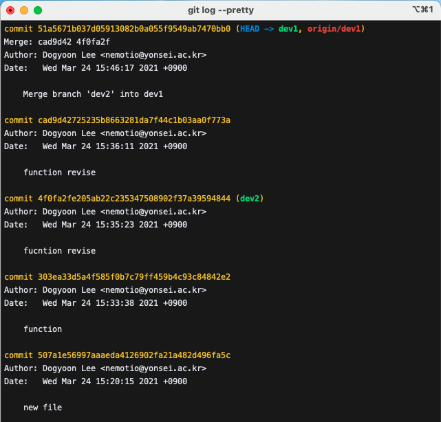
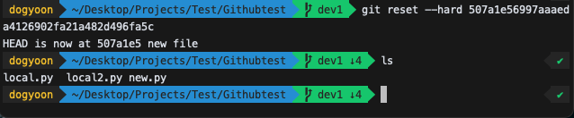
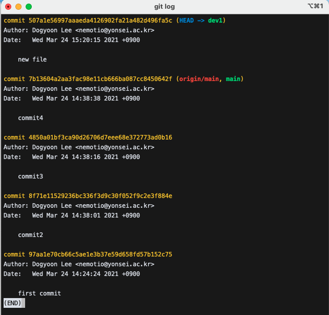
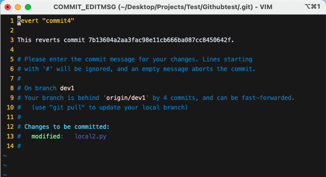
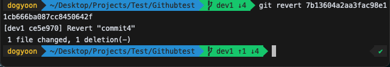

# GitHub Commit 되돌리기
## Commit 관리

앞서 말한대로 Commit의 목적은 버전을 기록하는 것이고 언제든 원하는 버전으로 돌아가고 싶다면 돌아갈 수 있다는 것이 장점이다.

커밋을 되돌리는 것은 쉽다.

### Reset

- `reset`은 지정한 커밋 당시로 되돌아가는 것이다. 시간을 되돌린다고 생각하면된다. 즉, 리셋을 사용하게 되면 지정한 커밋 이후의 히스토리는 모두 사라지게 된다. 예를들어 다음과 같은 히스토리가 있다.

	

    <em>[ git log --pretty를 통한 커밋 히스토리 조회 ]</em>

- 이때, `new file` 커밋으로 돌아가고 싶다고 해보자.
- `git reset --hard 507a1e56997aaaeda4126902fa21a482d496fa5c`를 사용해 돌아갈 수 있다.

	

    <em>[ reset을 통해 버전을 new file 커밋으로 되돌림 ]</em>

- `function.py` file이 사라진 것을 볼 수 있다.

	

    <em>[ 되돌아간 버전 ]</em>

- commit 히스토리도 줄어든 것을 볼 수 있다.
- 단, 이미 되돌리고자 하는 히스토리가 리모트 저장소에 푸쉬까지 된 상태라면 리셋 후 히스토리를 푸쉬할 때 `--force` 옵션을 사용해야 한다.

- `reset`명령어를 사용할 때 3개의 옵션을 사용할 수 있는데, 바로 `hard`, `soft`, `mixed`이다.
- 이 옵션들은 히스토리를 삭제한다는 것은 모두 동일하지만 삭제된 내용을 처리하는 방식이 조금씩 다르다

- `hard`: 지정한 커밋 이후의 히스토리가 삭제되고 **삭제된 내용들은 그대로 사라진다.**
- `soft`: 지정한 커밋 이후의 히스토리가 삭제되고 **삭제된 내용들은 스테이지로 이동한다.**(add한 상태로 변경)
- `mixed`: 지정한 커밋 이후의 히스토리가 삭제되고 **삭제된 내용들은 스테이지에 올라가지 않은 상태가 된다.**(다시 add 해주어야함)

### Revert

`revert`는 리셋처럼 히스토리를 다시 되돌리는 명렁어다. `reset`이 커밋 이후의 모든 히스토리를 없애버린다면, `revert`는 특정 커밋의 변경사항을 되돌리는 것이고, 히스토리가 삭제되는 것이 아니라 새로운 커밋히스토리로 남는다.

- `commit4`로 되돌리고 싶다고 해보자. 
- `git revert 7b13604a2aa3fac98e11cb666ba087cc8450642f`을 입력하면 되돌아가면서 새로운 커밋이 실행된다.

	

    <em>[ revert ]</em>

	

    <em>[ revert 후 commit 된다 ]</em>

- Commit 히스토리를 보면 Revert 되어서 새로 생긴 것을 볼 수 있다.

	

    <em>[ revert 후 커밋 히스토리 ]</em>

### 다음 페이지 바로가기

- [[메인페이지]](./README.md)
-  [[1. 깃허브 기초]](./GitHub_Basic.md.md)
-  [[2. 깃허브 브랜치]](./GitHub_Branch.md)
-  [[4. 깃허브 포크/클론/풀리퀘스트]](./GitHub_Fork_Clone_Pull_Request.md)

참고자료 및 그림 출처: [[Git 뉴비를 위한 기초 사용법 Blog]](https://evan-moon.github.io/2019/07/28/git-tutorial-advanced/)