# GitHub Clone/Fork/Pull_Request
## Clone

내가 생성하지 않은 다른 원격 저장소(GitHub)에서 소스코드를 다운받아 오고 싶을 수 있다.

로컬에 가져와서 테스트 용도로만 사용하거나 나에게 해당 Repository의 관리 권한이 있다면 `git clone` 을 통해 로컬로 복사해 작업하는 것으로 충분하다.

`clone`이란 원격 저장소에 있는 프로젝트를 내 로컬 환경에 복사해 오는 기능이다.

예를 들어 아래 repository의 코드를 내 로컬 환경에 다운받고 싶다고 해보자. 

마찬가지로 code버튼을 사용해 이 repository의 `url`을 복사한다.

	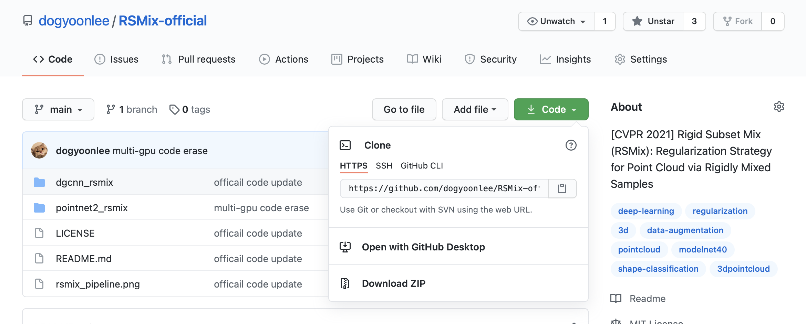

    <em>[ 원격저장소의 URL 복사 ]</em>

- `git clone` 명령어를 통해 간단하게 원격저장소의 내용을 복사해 올 수 있다. `clone`을 통해 복사해 온 코드는 관리 권한이 원본 repository 사용자에게 있으므로, 나에게 해당 repository의 관리 권한이 따로 없다면 추가적인 기여를 할 수 없다.

	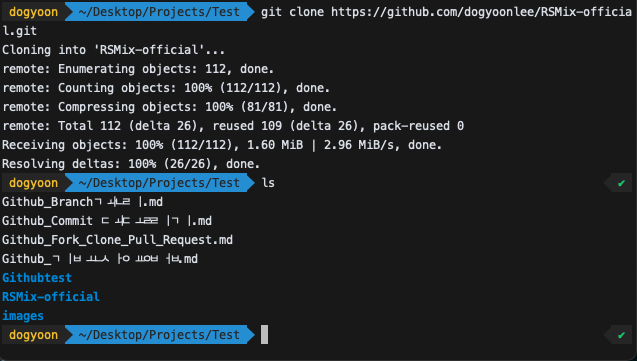

    <em>[ 원격저장소를 clone ]</em>

## Fork

만약 나에게 권한은 없지만 기여하고 싶은 프로젝트가 있다면 clone 이전에 먼저 해당 프로젝트를 fork 해오는 작업이 필요하다. `fork`는 다른사람의 저장소를 가져와 내 저장소를 만드는 기능이다.

- 가져오고 싶은 프로젝트의 repository에서 위의 **Fork** 버튼을 클릭하면 손쉽게 가져올 수 있다. 

	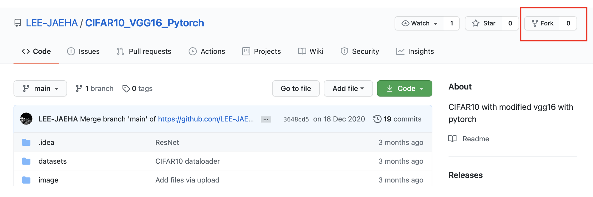

    <em>[ 원격저장소를 Fork ]</em>

- 이후 자신의 계정의 repository를 보면 아래와 같이 `fork`된 repository가 생성된 것을 확인할 수 있다.

	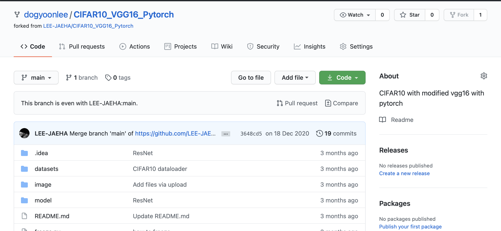

    <em>[ 원격저장소가 Fork 되었음 ]</em>

- 이제 `fork`된 repository를 Local에 `clone`하여 작업할 수 있다.

	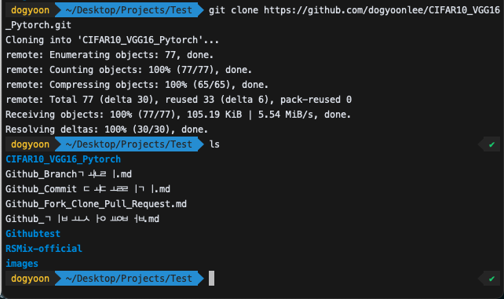

    <em>[ Fork해온 원격 저장소를 Clone ]</em>

- 다음과 같이 `fork`해온 원격 저장소를 수정해보자.
- 작업 후 add와 commit, push까지 하여 커밋을 남기면 이는 내가 `fork`한 내 repository에만 반영될 뿐, 원본 repository에는 아무런 영향을 줄 수 없다.

	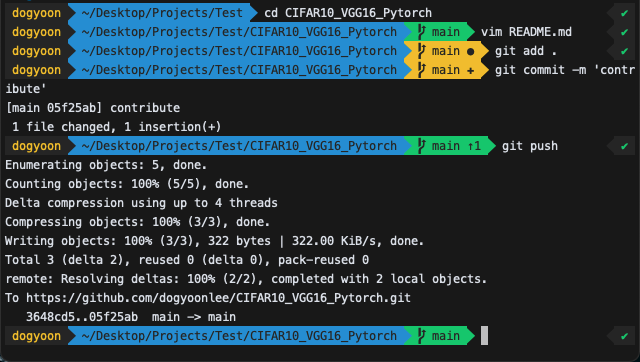

    <em>[ 내 repository에서 수정 ]</em>

- 나에게 해당 원본 repository에 대한 권한은 없기 때문에 반영되지 않음.

	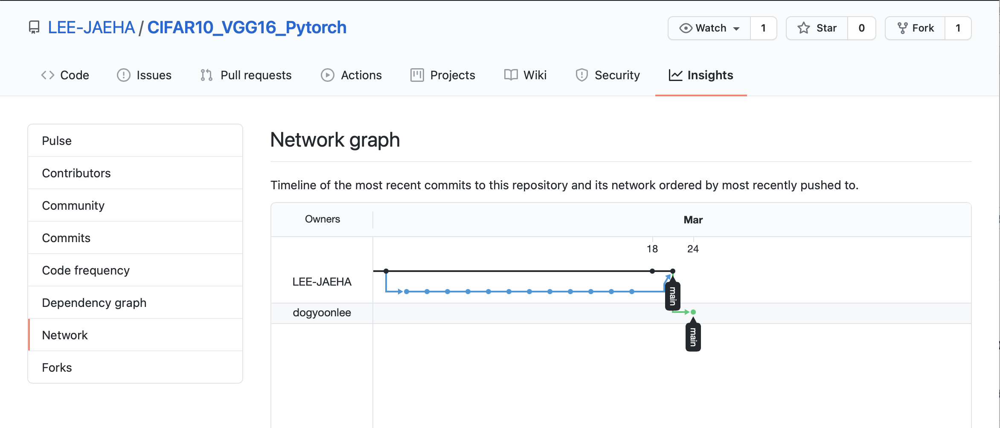

    <em>[ 원본 repository에서는 반영되지 않음 ]</em>

- 따라서, 자신의 개인 저장소에서 작업한 후 이 작업을 **원본 repository에 반영해달라고 요청할 수 잇음.**
- 이 과정이 **'Pull Request'** 이다.

- 자신이 Commit을 올린 자신의 `forked repository`의 메인화면을 보면 `Pull Request`를 할 수 있다
- `New pull request`를 클릭

	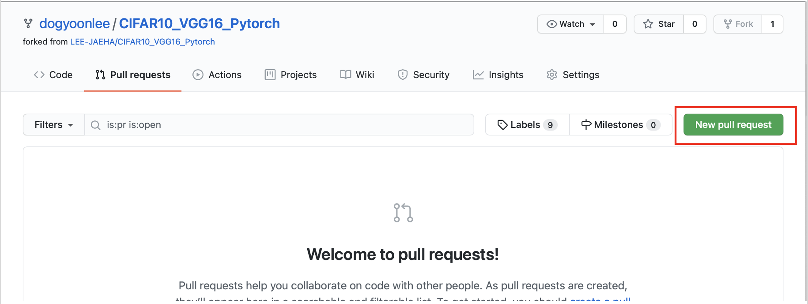

    <em>[ Pull Request ]</em>

 

- `Create pull request`버튼을 눌러주면 원본 repository 관리자에게 알림이 간다

	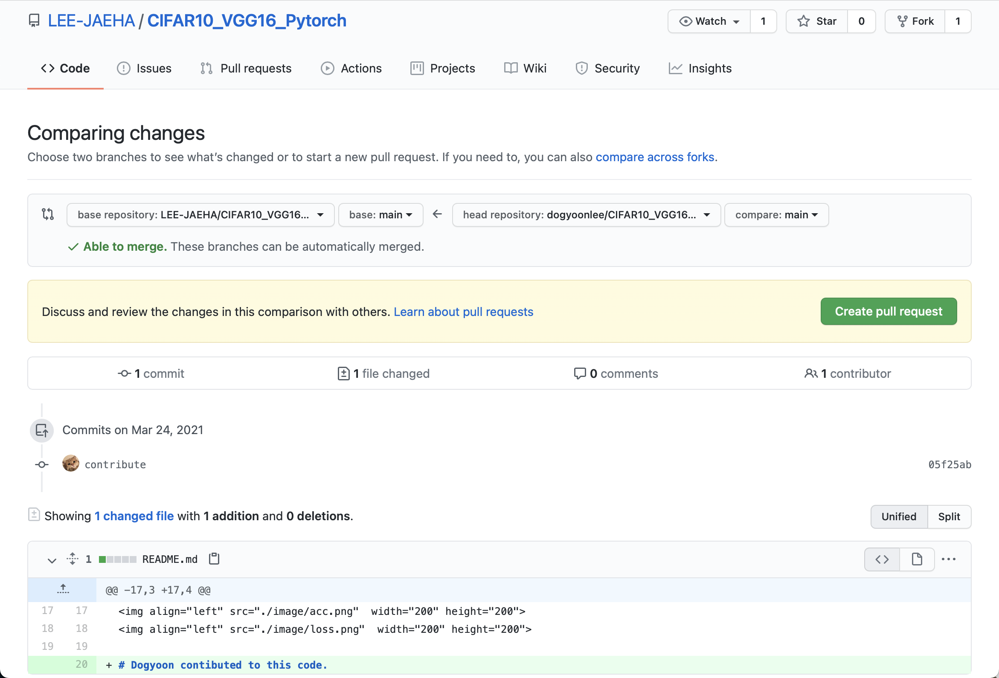

    <em>[ Create Pull Request ]</em>

 

	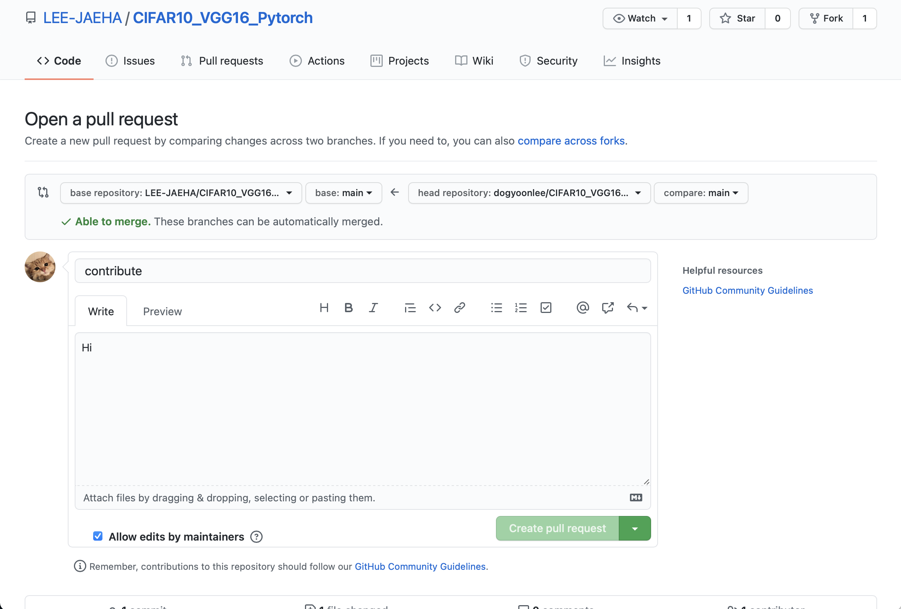

    <em>[ Create Pull Request 2 ]</em>

 

	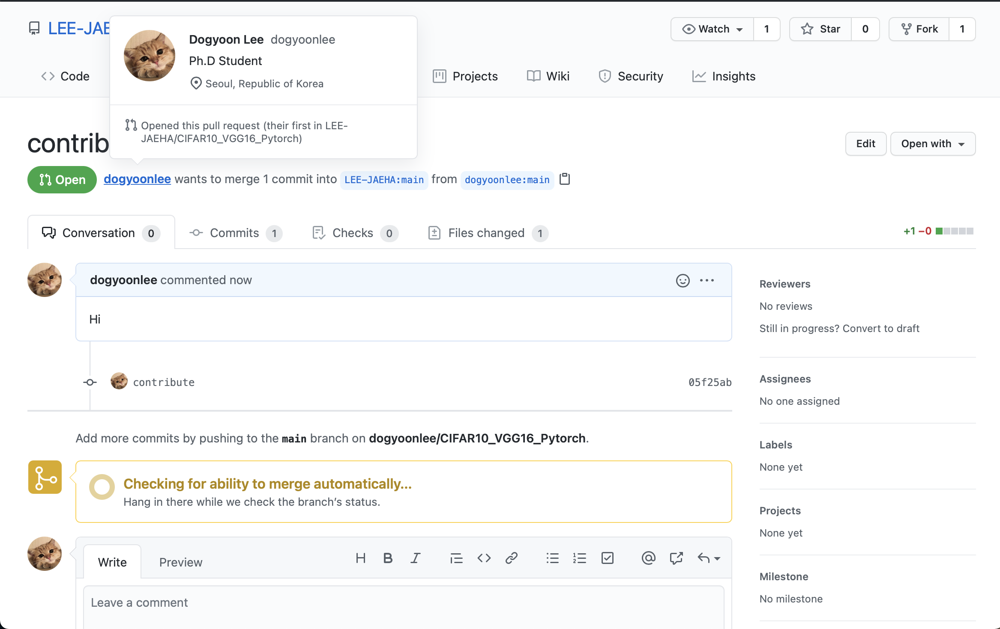

    <em>[ Create Pull Request 3 ]</em>

 

- 원본 Repository 관리자는 이를 확인하고 수락하여 해당 커밋을 원본 repository에 **merge**하거나 거절하는 등의 작업이 가능하다.
- 자신의 `pull request`가 받아들여졌는지에 대한 여부는 원본 repository의 pull request 탭에서 확인할 수 있다.

#### 요약
- `fork`를 통해 원본 repository를 가져와 내 repository를 만든다.
- `clone`을 통해 fork한 내 repository를 Local에 가져온다.
- Local에서 작업 후 `add`->`commit`->`push`를 통해 내 repository에 작업내용을 **업로드**한다.
- `Pull request`를 통해 내 작업내용을 원본 repository에 반영해달라고 요청한다.

참고자료 출처: [[Acka1357's Blog]](https://www.secmem.org/blog/2019/04/10/git_pr/)