# GitHub .gitignore 사용법
## Gitignore?

- 보통 `git add`를 활용하여 Staging Area에 파일들을 올릴때 파일을 하나 하나 올리는 것은 굉장히 불필요하고 귀찮은 일이다.
- 따라서 `git add .`을 활용하여 전체 업로드를 하는데, 때로는 파일의 용량문제, 혹은 올리고 싶지 않은 데이터들(데이터셋이라던지)과 같은 항목/디렉토리 들은 제외하고 `add`하고 싶은 경우에 사용하는 것이다.

## How to use .gitignore

### 파일 및 디렉토리 리스트 확인
- 다음과 같이 테스트트용 git repository를 만들어 보았다.
- `README.md` 파일만 존재한다.

	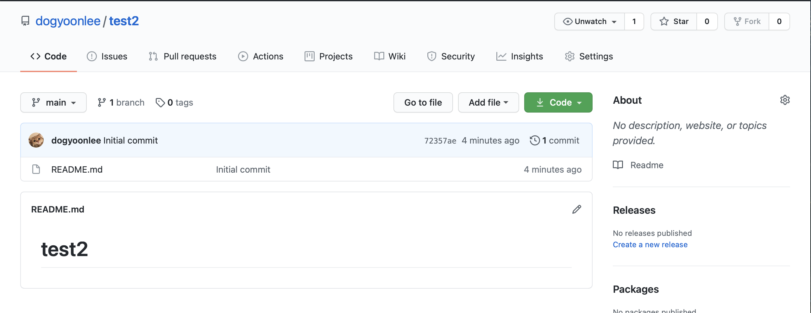

    <em>[ Test용 git repository  ]</em>

- Repository를 `clone`하고 `hello.cpp`, `local.py` 파일과 `items`디렉토리를 추가로 생성을 해보자.
 

	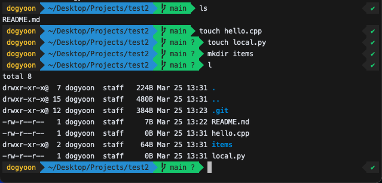

    <em>[ 파일 추가생성 ]</em>

### .gitignore 생성

- `git add`에 포함시키기 싫은 파일을 선정해보자
- `.gitignore`라는 디렉토리를 만들어 무시할 파일을 설정해 줄 수 있다.
- `git init`을 한 폴더에다가 `.gitignore`라는 이름으로 파일을 하나 만들어준다.
- `vim .gitignore`를 사용해 파일을 만들어주자
- 그 안에 한줄씩 제외할 파일 혹은 폴더를 쓰면 된다

### .gitignore 작성법
- `filename.js`: 특정 파일 **filename.js** 제외하기
- `/filename.js`: 현재 경로에 있는 **filename.js** 만 제외하기
- `node_module/`: 특정 폴더 **node_module** 안의 파일 다 제외하기
- `folder/my.txt`: 특정 경로의 특정 파일 제외하기
- `folder/**/filename_2.txt`: 특정 경로 아래의 모든 **filename_2.txt** 제외하기
- `*.txt`: 특정 확장자 파일 다 제외하기
- `!filename.txt`: 예외만들기

> 주석의 경우 #로 시작하는 줄이 주석에 해당한다. 또한 ignore 규칙을 정의하는 줄에서 주석을 함께 섞어 쓰는 것은 허용되지 않는다.
 
 
### Use .gitignore

- 한번 사용해보기 위해서  `items` 디렉토리 안에 `add.txt`, `function.txt`, `items_hello.py` 파일을 추가로 생성해보자.

	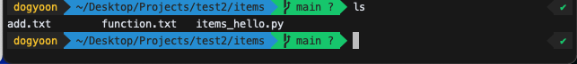

    <em>[ items 안에 파일 추가생성 ]</em>

- `test2` 디렉토리로 돌아가서 `vim .gitignore`를 사용해서 파일을 아래와 같이 작성해보자

	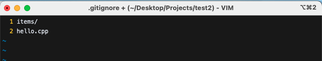

    <em>[ items 폴더 전체 무시, hello.cpp 파일 무시 ]</em>

- `git add .`+`git commit` + `git push` 해보자.

	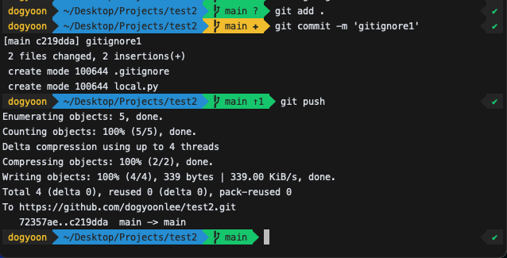

    <em>[ git repository에 push ]</em>

- git repository에서 확인

	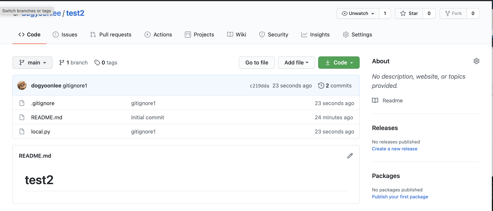

    <em>[ .gitignore이 잘 작동함 ]</em>

#### 툭정 폴더 내부의 특정 파일을 제외해보자
- `items`폴더 내부의 `function.txt` 파일을 제외해보자.

	

    <em>[ items/function.txt 파일 제외 ]</em>

	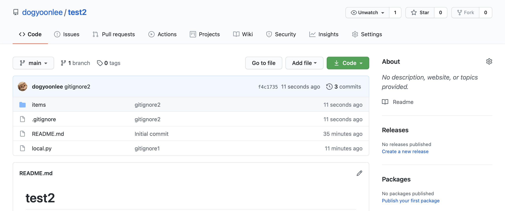

    <em>[ items 폴더는 제외되지 않음 ]</em>

	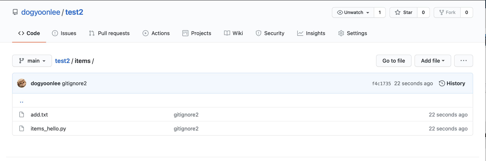

    <em>[ items/function.txt 파일은 제외됨 ]</em>

#### 특정 확장자를 제외해보자
- `.txt`확장자를 가진 파일을 제외해보자

	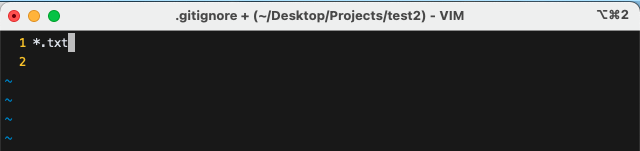

    <em>[ .txt 파일 제외 ]</em>

	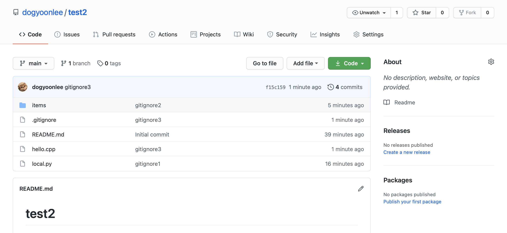

    <em>[ .txt 파일은 제외됨 ]</em>

	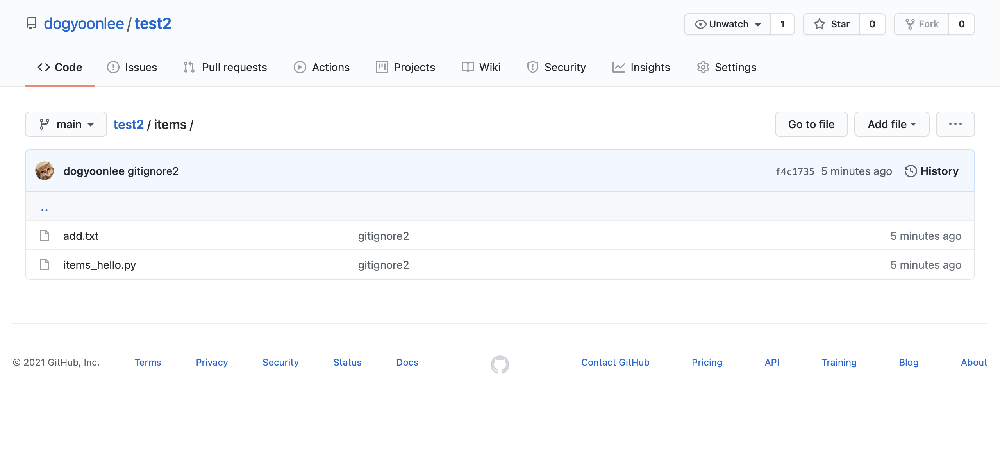

    <em>[ .txt 파일은 제외됨 ]</em>

- `items` 디렉토리에 들어가보면 `.txt`확장자를 가진 파일은 `push`되지 않았음을 알수있다.
 

### 다음 페이지 바로가기

- [[메인페이지]](./README.md)
- [[1. GitHub Basic]](./GitHub_Basic.md)
- [[2. 깃허브 브랜치]](./GitHub_Branch.md)
- [[3. 깃허브 커밋 되돌리기]](./GitHub_Commit_reset_revert.md)
- [[4. 깃허브 포크/클론/풀리퀘스트]](./GitHub_Fork_Clone_Pull_Request.md)

참고자료 출처: [[서상혁님 Tistory]](https://programming119.tistory.com/105)